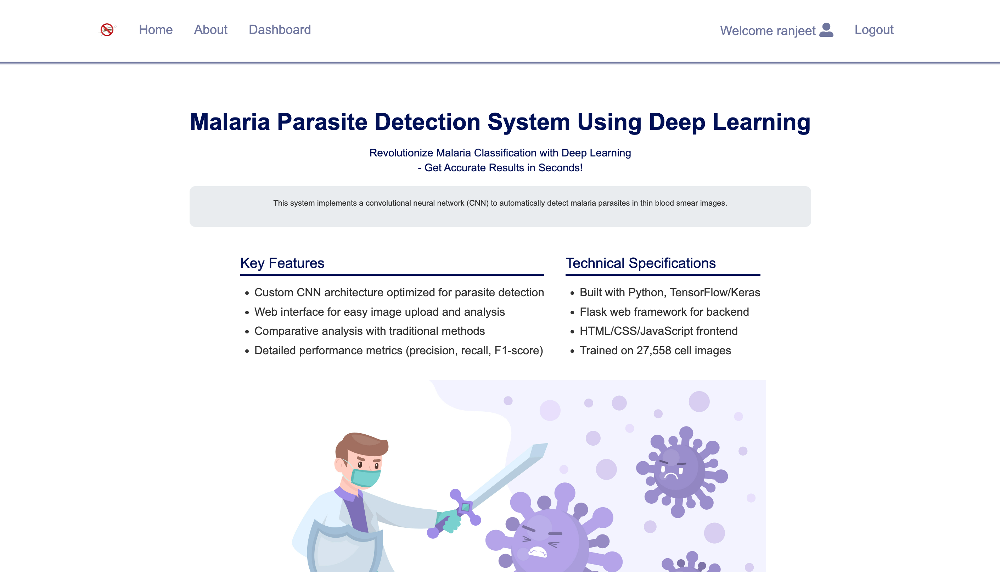
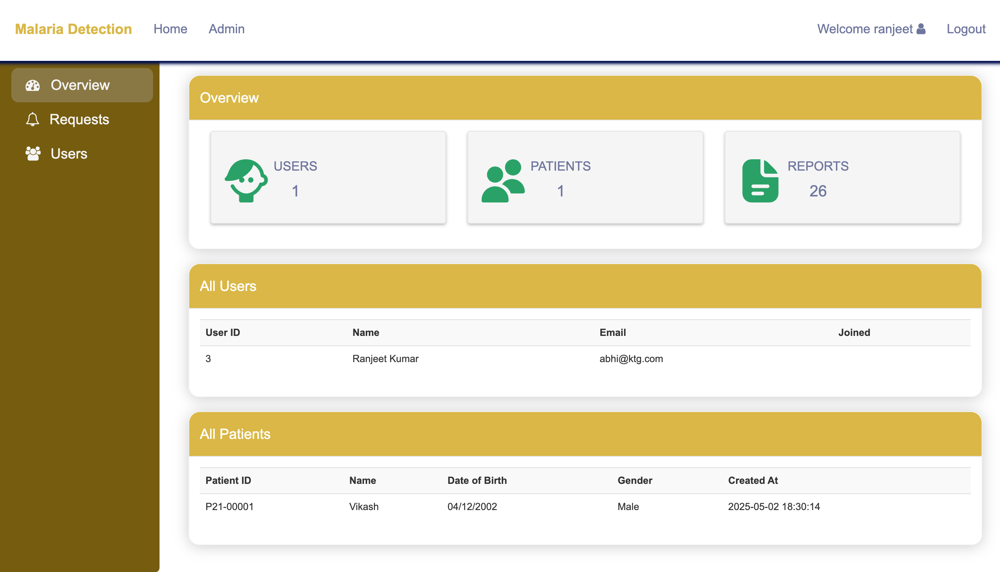
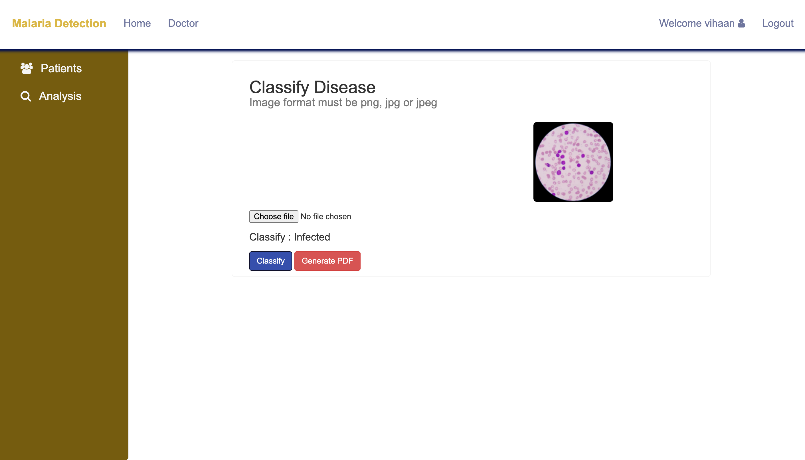
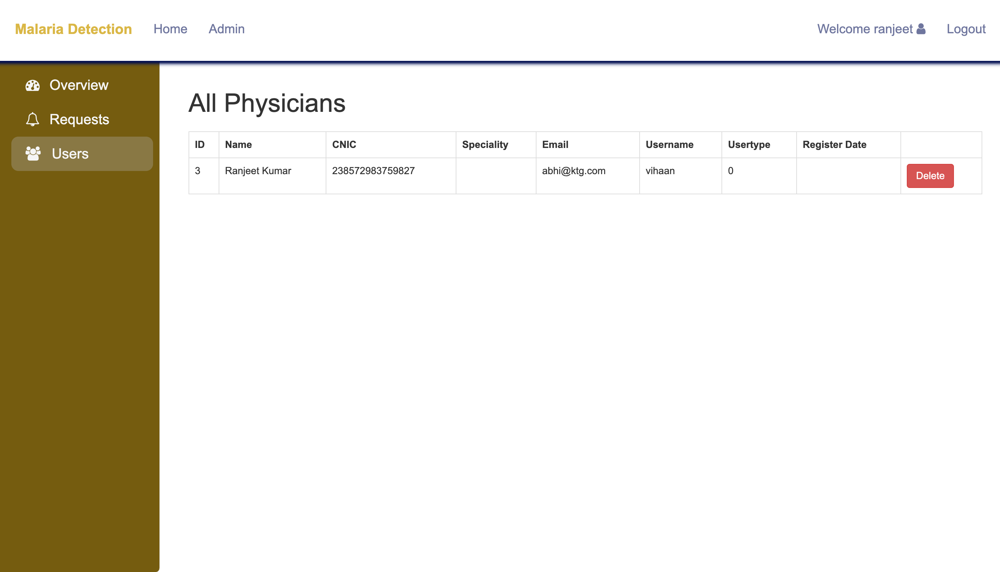

# 🦠 Malaria Detection System

## 📌 Overview

The **Malaria Detection System** is a web-based application built using **Flask** that enables users to analyze blood smear images for malaria diagnosis. Designed with a user-friendly interface, the platform facilitates image uploads, patient management, and role-based access for doctors and admins. The system also integrates with **MySQL (via XAMPP)** for persistent data storage.

<div style="display: flex; justify-content: space-between;">
    
    
</div>
<div style="display: flex; justify-content: space-between;">
    
    
</div>

---

## 🚀 Key Features

- **🔐 User Roles**
  - **Admin**: Manage doctors, view all patient records, and approve users.
  - **Doctor**: Upload and analyze patient data, and view test results.

- **👨‍⚕️ Patient Management**
  - Add, edit, and delete patient information including medical history and test results.

- **🖼️ Image Upload & Detection**
  - Upload blood smear images.
  - Detect presence of malaria parasites using built-in image processing logic.

- **📊 Results Dashboard**
  - View and interpret the results through a clean, interactive UI.

- **🗃️ Database Integration**
  - Backed by MySQL (via XAMPP), allowing for robust and scalable data handling.

---

## 🧰 Prerequisites

Ensure the following tools are installed before setting up the project:

- [Python 3.x](https://www.python.org/)
- [XAMPP (for MySQL)](https://www.apachefriends.org/index.html)
- `mysql-connector-python` (install via pip)

---

## ⚙️ Installation Guide

1. **Clone the repository:**

   ```bash
   git clone https://github.com/khalid-akhss19/Malaria-Identification-System.git
   cd Malaria-Identification-System
   ```

2. **(Optional) Create a virtual environment:**

   ```bash
   python -m venv venv
   ```

   Activate it:

   - **Windows**: 
     ```bash
     venv\Scripts\activate
     ```
   - **macOS/Linux**: 
     ```bash
     source venv/bin/activate
     ```

3. **Install dependencies:**

   ```bash
   pip install -r requirements.txt
   ```

4. **Set up the MySQL database:**
   - Open [phpMyAdmin](http://localhost/phpmyadmin) or use MySQL CLI.
   - Import the `test.sql` file located in the project root directory.

---

## ▶️ Running the Application

Start the Flask server with:

```bash
python app.py
```

Then, open your browser and visit:

```
http://localhost:5000
```

Use the web interface to:
- Log in as a doctor or admin.
- Upload patient data and blood smear images.
- View diagnostic results.

---

## 📁 Folder Structure (optional)

```
Malaria-Identification-System/
│
├── app.py                  # Main Flask app
├── requirements.txt        # Python dependencies
├── templates/              # HTML templates
├── static/                 # CSS, JS, and image files
├── public/                 # Sample output screenshots
└── test.sql                # SQL dump file for MySQL database
```

---

